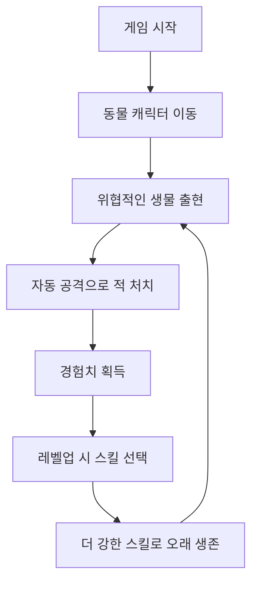
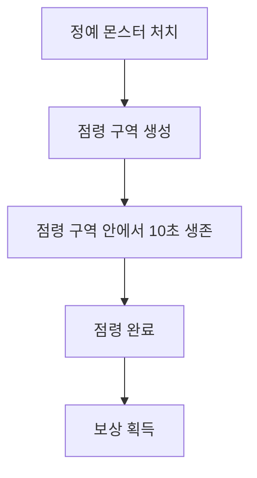

# 토리와 야생의 숲 기획서

## 기본 정보

| 항목 | 내용 |
| --- | --- |
| 게임명 | 토리와 야생의 숲 |
| 장르 | 모바일 2D 뱀서라이크 |
| 한 줄 소개 | 작은 동물이 각성 능력을 얻고, 야생에서 몰려오는 위협을 상대하며 살아남는 게임 |

## 게임 컨셉

플레이어는 고양이, 토끼, 다람쥐 같은 작은 동물이 된다. 평범한 동물이었던 토리는 생존을 위해 각성 능력을 얻게 되고, 숲속에서 마주치는 위협적인 생물들을 상대하며 살아남는다.

게임은 복잡한 조작보다 쉬운 이동 조작, 자동 공격, 스킬 선택, 시원한 처치감에 집중한다.

## 조작 방식

- 모바일 화면에서 캐릭터 이동만 조작한다.
- 공격과 스킬은 자동으로 발동된다.
- 플레이어는 적을 피하면서 경험치를 모으고, 레벨업을 통해 더 강한 스킬을 선택한다.

## 기본 플레이 흐름

## 플레이어 후보

### 고양이

- 특징: 빠르고 민첩한 기본 캐릭터. 가까운 적을 빠르게 공격하거나 피하면서 전투한다.
- 스킬 예시: 발톱 베기, 점프 공격, 그림자 이동, 야생 본능
- 캐릭터 느낌: 귀엽지만 날렵하다. 초보자가 사용하기 쉬운 기본 캐릭터로 적합하다.

### 토끼

- 특징: 작고 빠른 캐릭터. 빠른 이동과 회피를 중심으로 살아남는다.
- 스킬 예시: 점프 충격파, 당근 투척, 빠른 회피, 달빛 강화
- 캐릭터 느낌: 약해 보이지만 성장하면 강해지는 반전 매력이 있다.

### 다람쥐

- 특징: 귀엽고 독창적인 캐릭터. 도토리와 나뭇잎 같은 자연 요소를 활용해 전투한다.
- 스킬 예시: 도토리 탄환, 나뭇잎 회오리, 덩굴 함정, 거대 도토리 폭발
- 캐릭터 느낌: 작고 귀여운 느낌이 강하며, 다른 게임과 차별화하기 좋다.

## 적 컨셉

자연 속에서 마주치는 위협적인 생물들이 적으로 등장한다. 적은 오염되거나 괴물화된 존재가 아니라, 야생에서 만날 수 있는 동물과 생물을 기반으로 한다. 다만 게임에서 적이라는 점이 잘 보이도록 플레이어보다 조금 더 위협적인 인상으로 디자인한다.

### 일반 적

| 적 | 역할 |
| --- | --- |
| 벌레 | 가장 기본이 되는 약한 적. 빠르게 많이 등장해 초반 전투감을 만든다. |
| 뱀 | 플레이어를 따라오는 근접형 적. 부드럽고 위협적인 움직임을 가진다. |
| 까마귀 | 빠르게 접근하는 적. 밤의 숲이나 넓은 풀밭에 잘 어울린다. |
| 여우 | 민첩한 중급 적. 고양이나 토끼보다 날카로운 인상이다. |
| 멧돼지 | 체력이 높고 묵직한 적. 천천히 다가오지만 맞으면 위험하다. |
| 독수리 | 후반부에 등장하는 강한 공중 포식자형 적. |

### 보스

| 보스 | 스테이지 | 컨셉 |
| --- | --- | --- |
| 거대 멧돼지 | 초록 숲 | 크고 단단하며 돌진 패턴을 가진다. |
| 거대 올빼미 | 밤의 숲 | 어두운 분위기와 어울리며 빠른 공격 패턴을 가진다. |
| 거대 여우 | 넓은 풀밭 | 민첩하고 날렵한 움직임을 가진다. |
| 곰 보스 | 후반부 후보 | 강하고 압도적인 최종 보스형 적이다. |

## 스테이지 공통 방향

- 장애물이나 복잡한 지형보다 배경 분위기, 맵 크기, 등장 적, 웨이브 패턴으로 차이를 둔다.
- 모든 맵은 탑다운 시점으로 플레이한다.
- 스테이지 플레이 시간은 10분이다.
- 2분마다 정예 몬스터가 등장한다.
- 정예 몬스터 처치 시 점령 구역이 생성된다.
- 점령 구역에서 10초 동안 생존하면 보상을 획득한다.
- 보상은 경험치, 무기, 강화 선택지 중 랜덤 지급한다.
- 10분 도달 시 보스가 등장하고, 보스를 처치하면 스테이지를 클리어한다.

### 맵 유형

| 유형 | 설명 |
| --- | --- |
| 무한 맵 | 플레이어 중심으로 맵이 계속 이어지는 구조. 이동 제약이 적고, 적을 유인하며 생존하는 플레이에 유리하다. |
| 제한 맵 | 정해진 크기의 맵. 맵 끝에서 이동이 막히며, 공간 활용과 위치 선정이 중요하다. |

## 스테이지 목록

### 초록 숲

- 설명: 가장 기본이 되는 첫 번째 스테이지. 밝은 숲과 풀밭이 배경이며 약한 적들이 균형 있게 등장한다.
- 특징: 기본 조작과 전투 방식을 익히기 좋고, 적 속도와 체력이 낮다.
- 맵 구조: 무한 맵, 넓은 숲과 잔디 배경, 장애물 없음
- 등장 적: 벌레, 뱀, 까마귀, 멧돼지
- 보스: 거대 멧돼지

| 시간 | 진행 |
| --- | --- |
| 0~2분 | 벌레 등장, 적 개체 수 적음, 기본 조작 학습 |
| 2분 | 정예 멧돼지 등장, 처치 시 점령 구역 생성 |
| 2~5분 | 벌레와 뱀 등장, 적 체력 증가 |
| 5분 | 까마귀 떼 웨이브 발생 |
| 5~8분 | 멧돼지 등장, 적 생성량 증가 |
| 8분 | 정예 멧돼지 등장 |
| 8~10분 | 모든 적 등장, 적 밀집도 증가 |
| 10분 | 거대 멧돼지 등장 |

### 밤의 숲

- 설명: 어두운 분위기의 스테이지. 빠른 적들이 자주 등장하며 플레이어를 지속적으로 압박한다.
- 특징: 초록 숲보다 적 이동 속도가 빠르고, 공간이 제한되어 생존 난이도가 높다.
- 맵 구조: 제한 맵, 중형 크기, 숲과 바위 지형으로 둘러싸인 공간
- 등장 적: 박쥐, 올빼미, 뱀, 여우
- 보스: 거대 올빼미

| 시간 | 진행 |
| --- | --- |
| 0~2분 | 박쥐 등장, 빠른 적 적응 구간 |
| 2분 | 정예 박쥐 등장 |
| 2~5분 | 올빼미 등장, 빠른 추적 패턴 추가 |
| 5분 | 박쥐 대량 웨이브 발생 |
| 5~8분 | 여우 등장, 적 이동 속도 증가 |
| 8분 | 정예 올빼미 등장 |
| 8~10분 | 박쥐와 여우 혼합 웨이브 |
| 10분 | 거대 올빼미 등장 |

### 넓은 풀밭

- 설명: 맵 규모가 넓은 스테이지. 시간이 지날수록 엄청난 수의 적이 몰려온다.
- 특징: 적 개체 수가 가장 많고, 광역 무기의 효율이 높으며 대량 처치의 재미를 강조한다.
- 맵 구조: 무한 맵, 가장 넓은 맵 크기, 장애물 없음
- 등장 적: 벌레 떼, 까마귀, 여우, 멧돼지
- 보스: 거대 여우

| 시간 | 진행 |
| --- | --- |
| 0~2분 | 벌레 떼 등장, 많은 적과 전투 |
| 2분 | 정예 벌레 군체 등장 |
| 2~5분 | 까마귀 무리 등장 |
| 5분 | 초대형 웨이브 발생 |
| 5~8분 | 여우 등장, 적 생성량 증가 |
| 8분 | 정예 여우 등장 |
| 8~10분 | 최대 개체 수 도달 |
| 10분 | 거대 여우 등장 |

### 늪지대

- 설명: 독과 늪으로 오염된 지역. 적의 수는 많지 않지만 지속 피해와 상태 이상으로 플레이어를 괴롭힌다.
- 특징: 상태 이상 중심, 독 피해, 생존 관리 중요
- 맵 구조: 제한 맵, 늪지와 진흙 지형, 좁은 이동 공간
- 등장 적: 독 벌레, 독 거미, 늪 악어, 독 두꺼비
- 보스: 늪의 군주

| 시간 | 진행 |
| --- | --- |
| 0~2분 | 독 벌레 등장 |
| 2분 | 정예 독 두꺼비 등장 |
| 2~5분 | 독 거미 등장 |
| 5분 | 독 안개 웨이브 발생 |
| 5~8분 | 늪 악어 등장 |
| 8분 | 정예 늪 악어 등장 |
| 8~10분 | 독 적 대량 등장 |
| 10분 | 늪의 군주 등장 |

### 설원

- 설명: 차가운 눈보라가 몰아치는 설원. 적의 공격뿐 아니라 둔화 효과도 주의해야 한다.
- 특징: 둔화 중심, 기동성 중요, 회피 플레이 강조
- 맵 구조: 제한 맵, 눈밭과 얼음 지형, 좁은 이동 경로
- 등장 적: 눈 토끼, 눈 여우, 설원 늑대, 설원 곰
- 보스: 설산의 수호자

| 시간 | 진행 |
| --- | --- |
| 0~2분 | 눈 토끼 등장 |
| 2분 | 정예 설원 늑대 등장 |
| 2~5분 | 눈 여우 등장 |
| 5분 | 눈보라 웨이브 발생 |
| 5~8분 | 설원 곰 등장 |
| 8분 | 정예 설원 곰 등장 |
| 8~10분 | 모든 적 등장 |
| 10분 | 설산의 수호자 등장 |

## 점령 시스템

정예 몬스터 처치 시 생성되는 특별 이벤트 시스템이다. 플레이어는 점령 구역 안에서 일정 시간 동안 생존해야 하며, 성공 시 강력한 보상을 획득한다.

### 보상 종류

- 경험치 대량 획득
- 무기 획득
- 무기 진화 재료 획득
- 강화 선택 기회
- 체력 회복
- 특수 강화 획득

### 목적

단순히 적을 처치하는 것뿐만 아니라 위험을 감수하고 추가 보상을 획득하는 선택 요소를 제공한다. 이를 통해 플레이어는 "정예 사냥 → 점령 → 보상 → 성장"의 추가 게임 루프를 경험한다.

## 핵심 재미

1. 귀여운 동물이 강해지는 성장감
2. 쉬운 모바일 조작
3. 자동 공격의 편한 전투
4. 레벨업 스킬 선택
5. 시원한 처치감
6. 스테이지별 다른 분위기

## 구현 메모

- 현재 프로젝트에는 `WaveManager`, `WavePhaseData`, `RewardData`, `LevelUpUI`, `PlayerMovement`, `PoolManager`가 이미 존재한다.
- 기획서의 스테이지/맵/점령 구역은 기존 구조를 유지하면서 `ScriptableObject` 데이터와 얇은 런타임 컴포넌트로 확장하는 방향이 적합하다.
- 적 종류와 보스는 현재 `PoolType`에 구체적으로 분리되어 있지 않으므로, 새 적 프리팹과 풀 등록이 준비될 때 단계적으로 추가한다.
- 점령 시스템은 정예 적 처치 이벤트와 보상 시스템을 연결하는 중간 루프로 구현한다.
